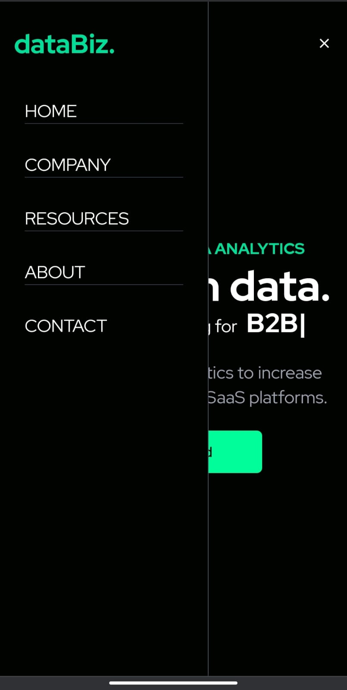

<h1 align="center"> dataBiz. </h1>

#### dataBiz is a website built with React and Tailwind Css. It also uses react-icons and react-typed libraries. It uses Framer motion for animation.

## Tech used: 

<!-- ## Screenshots: 

 -->

## Screenshots: 

## Desktop View:

<table>
  <tr>
    <td>
      
    </td>
    <td>
      
    </td>
  </tr>
  <tr>
    <td>
      
    </td>
    <td>
      
    </td>
  </tr>
</table>

## Mobile View:
<table>
  <tr>
    <td>
      
    </td>
    <td>
      
    </td>
  </tr>
</table>